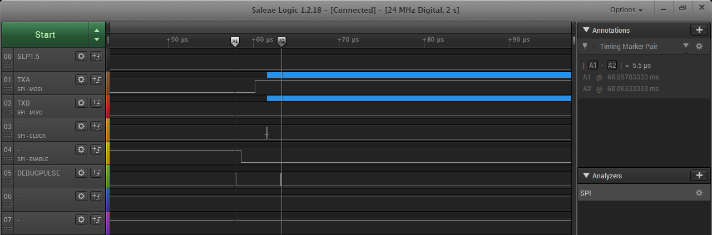
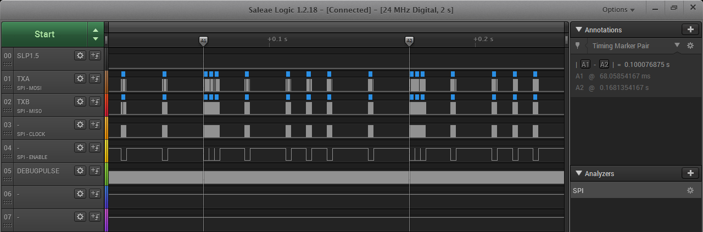

# Arinc429
Arinc 429 related projects

## Arinc 429 TX

Interrupt driven Arinc429 transmit code for use with  [HOLT IC](https://www.holtic.com/)  drivers [HI-8585/HI-8586](http://www.holtic.com/documents/85-hi-8585_v-rev-ppdf.do).

### Features:
- ATMegaxx8 based
- Scheduler with 1ms resolution for 64 messages;
- Transmission queue with 64 entries;
- Scheduler and Transmission queue can be increased up to the extent of RAM available;
- Low CPU consumption, roughly 15% (~6us out of each 40us for ATmega running @16MHz);
- Bit fields to access Label, Data, SSM, SDI and parity;
- Programmable Intergap Message (down to zero);
- Messagens can be silenced;
- Macros to drive pins to debug like 32 bits SPI on logic analyzers; 
- Can be compiled within Arduino IDE, or externally (Makefile for AVR-GCC provided);
- Released under [GPL V3](https://www.gnu.org/licenses/gpl-3.0.html);

### Connections
|  AVR  |  HI-8585/8586 pin  |
| ----------- | ----------- |
|  PB1  |  TX1IN (3)  |
|  PB2  |  TX0IN (2)  | 

#### SPI Style debuging
|  AVR  |  SPI pin  |
| ----------- | ----------- |
|  PB1  |  MOSI (TX1IN)  |
|  PB2  |  MISO (TX0IN)  | 
|  PB3  |  CLOCK  |
|  PB4  |  /SELECT  | 

##### SPI style debug

##### single bit processing time

##### Scheduler in action

